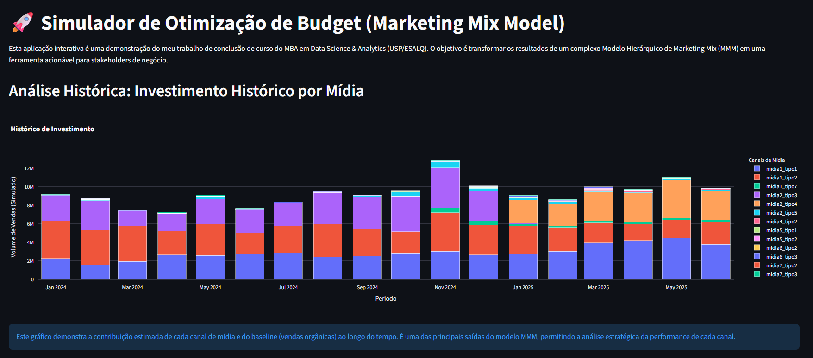
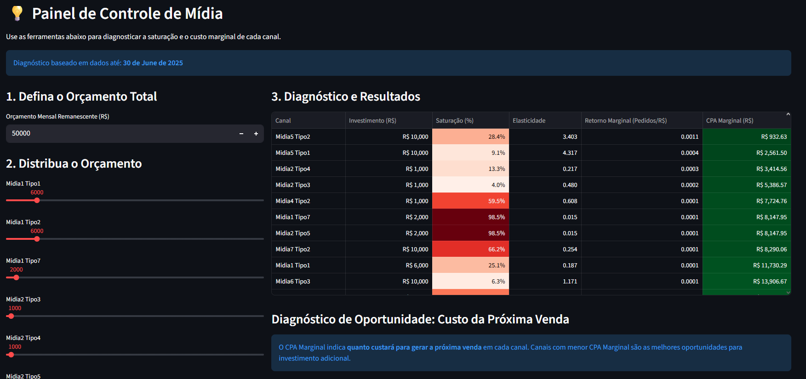
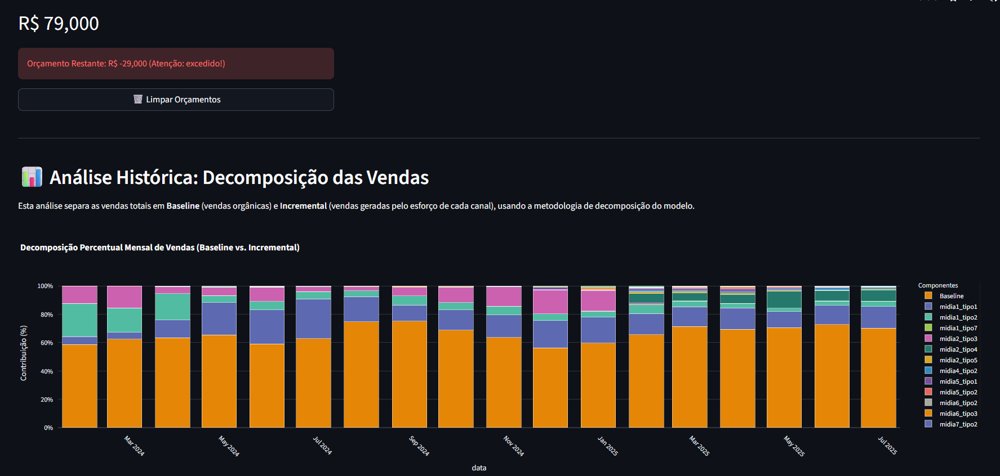

# 📊 Interactive Data Visualization Dashboard: Marketing Mix Model (MMM)
**By Roberto Oliveira** | *Lead Data Scientist & Analytics (USP / Actuarial Science)*

Este projeto utiliza técnicas avançadas de **Data Visualization** e **Data Storytelling** para entregar uma solução de inteligência de marketing de alto impacto.

---

## 🎯 Executive Summary (Business Value)
This project delivers a high-stakes marketing intelligence solution designed to optimize **P&L and Media Spend**. 

The engine quantifies the marginal contribution of multiple media channels on sales performance. It empowers stakeholders to run **"What-if" simulations**, allowing for data-driven budget reallocation to maximize ROI and minimize capital waste.

## 🛠️ Statistical Rigor & Methodology
Moving beyond simple linear fits, this implementation adheres to the highest standards of **Statistical modeling**:

- **Dynamic Feature Engineering:** Seamless integration with the Central Bank of Brazil (SGS API) to fetch macroeconomic indicators (Inflation, Interest Rates) as control variables.
- **Advanced Pre-processing:** Implementation of **Box-Cox transformations** for normality, **RobustScaler** for outlier resilience, and **VIF (Variance Inflation Factor)** analysis to mitigate multicollinearity.
- **Isotonic Regression:** Applied to ensure media response curves follow the law of **diminishing returns**, providing realistic saturation points for budget scaling.
- **Academic Foundation:** This project is an evolution of my Data Science specialization at the **University of São Paulo (USP)**.

## 🏗️ Technical Architecture (MLOps Ready)
The codebase is structured for scalability and production-grade deployment:

- `/artifacts`: Persistent storage for pre-trained models and optimal parameters (Joblib serialization).
- `/src`: Core training and data processing pipelines.
- `app.py`: Interactive decision-support interface built with **Streamlit** and **Plotly**.
- `Dockerfile`: Containerized environment ready for seamless deployment on **AWS, Azure, or GCP**.

## 🛠️ Ferramentas & Skills (Tech Stack)

- **Visualização & BI:** Plotly, Streamlit, Data Storytelling, Power BI (Básico), Tableau (Básico), Excel, Dashboards.
- **Data Science & ML:** Python (MixedLM, Scikit-learn, Pandas), Machine Learning (Clustering, Churn), MLOps, SQL.
- **Infraestrutura:** Docker, GCP Deployment Ready.

### Quick Start
**Running via Docker:**
1. `docker build -t mmm-engine .`
2. `docker run -p 8501:8501 mmm-engine`

## 📊 Interactive Dashboards & Data Storytelling

O dashboard fornece uma visão executiva da atribuição de mídia e cenários de orçamento, facilitando a **tomada de decisão** baseada em dados e a **narrativa** dos resultados de marketing.

<table border="0">
 <tr>
    <td align="center"><b align="center">Investment History (Dashboard)</b> </td>
    <td align="center"><b align="center">Budget Simulator</b> </td>
    <td align="center"><b align="center">Sales Decomposition</b> </td>
 </tr>
</table>